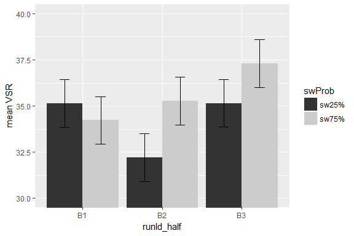
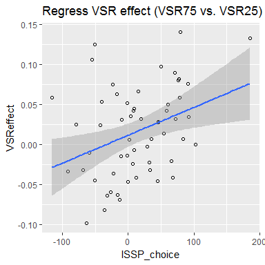
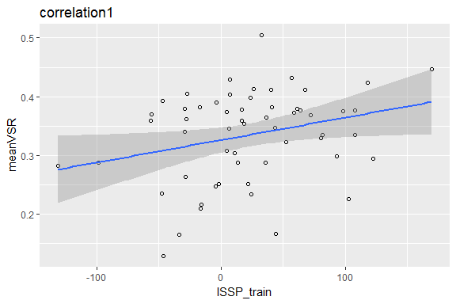

ISSPxVTS\_v5 analysis
================
Yu-Chin Chiu
June 11, 2018

``` r
knitr::opts_chunk$set(fig.width=6, fig.height=4, fig.path='figure/', echo = FALSE, warning = FALSE, message = FALSE)
options(width = 9999)
```

#### First, Set up the environment and load the data: gpData.csv

This file came from python scripts - cleaning and preprocessing

#### Set up some formating for the plots

Set up some good format, here I am using apatheme with white background, with black axis lines, no grids.

    ## [1] 52

    ## [1] 38

RESULTS:
--------

### 1. Cued trials

#### Analyze with 2 phase x 2 swProb x trialType\_sw

#### Figure 1: RT


    ## 
    ## 
    ## ANOVA results
    ##  
    ## 
    ##                      Predictor df_num df_den       SS_num     SS_den       F    p ges
    ##                    (Intercept)      1     37 198066957.89 3089956.05 2371.71 .000 .98
    ##                          phase      1     37     14325.23  130061.41    4.08 .051 .00
    ##                         swProb      1     37       475.72   31520.17    0.56 .460 .00
    ##                   trialType_sw      1     37    299722.56  158274.59   70.07 .000 .08
    ##                 phase x swProb      1     37       166.06   27673.13    0.22 .640 .00
    ##           phase x trialType_sw      1     37      3632.83   32604.55    4.12 .050 .00
    ##          swProb x trialType_sw      1     37      7225.17   29185.55    9.16 .004 .00
    ##  phase x swProb x trialType_sw      1     37      2736.56   25114.23    4.03 .052 .00
    ## 
    ## Note. df_num indicates degrees of freedom numerator. df_den indicates degrees of freedom denominator. 
    ## SS_num indicates sum of squares numerator. SS_den indicates sum of squares denominator. 
    ## ges indicates generalized eta-squared.
    ## 

#### Figure 2: Acc


    ## 
    ## 
    ## ANOVA results
    ##  
    ## 
    ##                      Predictor df_num df_den SS_num SS_den        F    p  ges
    ##                    (Intercept)      1     37 255.64   0.59 15931.94 .000 1.00
    ##                          phase      1     37   0.00   0.23     0.01 .918  .00
    ##                         swProb      1     37   0.00   0.06     0.08 .775  .00
    ##                   trialType_sw      1     37   0.02   0.05    19.39 .000  .02
    ##                 phase x swProb      1     37   0.00   0.04     1.24 .273  .00
    ##           phase x trialType_sw      1     37   0.00   0.04     1.08 .305  .00
    ##          swProb x trialType_sw      1     37   0.00   0.04     0.43 .517  .00
    ##  phase x swProb x trialType_sw      1     37   0.00   0.03     0.30 .589  .00
    ## 
    ## Note. df_num indicates degrees of freedom numerator. df_den indicates degrees of freedom denominator. 
    ## SS_num indicates sum of squares numerator. SS_den indicates sum of squares denominator. 
    ## ges indicates generalized eta-squared.
    ## 

### 2. Choice trials

#### Analyze with RT/ACC with 2 swProb x 2 trialType\_sw

#### Figure 3: RT


    ## 
    ## 
    ## ANOVA results
    ##  
    ## 
    ##              Predictor df_num df_den      SS_num     SS_den       F    p ges
    ##            (Intercept)      1     37 85058092.02 1239734.84 2538.57 .000 .98
    ##                 swProb      1     37      688.91   42320.03    0.60 .443 .00
    ##           trialType_sw      1     37    68452.95   59259.24   42.74 .000 .05
    ##  swProb x trialType_sw      1     37      416.06   25380.75    0.61 .441 .00
    ## 
    ## Note. df_num indicates degrees of freedom numerator. df_den indicates degrees of freedom denominator. 
    ## SS_num indicates sum of squares numerator. SS_den indicates sum of squares denominator. 
    ## ges indicates generalized eta-squared.
    ## 

#### Figure 4: ACC


    ## 
    ## 
    ## ANOVA results
    ##  
    ## 
    ##              Predictor df_num df_den SS_num SS_den        F    p  ges
    ##            (Intercept)      1     37 141.84   0.10 53433.84 .000 1.00
    ##                 swProb      1     37   0.00   0.02     0.16 .695  .00
    ##           trialType_sw      1     37   0.00   0.04     0.35 .555  .00
    ##  swProb x trialType_sw      1     37   0.00   0.03     0.41 .524  .00
    ## 
    ## Note. df_num indicates degrees of freedom numerator. df_den indicates degrees of freedom denominator. 
    ## SS_num indicates sum of squares numerator. SS_den indicates sum of squares denominator. 
    ## ges indicates generalized eta-squared.
    ## 

### 3. Choice trials

#### Analyze VSR and tskRatio with 2 swProb

#### Figure 5: VSR


    ## 
    ## 
    ## ANOVA results
    ##  
    ## 
    ##    Predictor df_num df_den SS_num SS_den      F    p ges
    ##  (Intercept)      1     37   9.25   0.35 974.24 .000 .96
    ##       swProb      1     37   0.00   0.06   2.55 .119 .01
    ## 
    ## Note. df_num indicates degrees of freedom numerator. df_den indicates degrees of freedom denominator. 
    ## SS_num indicates sum of squares numerator. SS_den indicates sum of squares denominator. 
    ## ges indicates generalized eta-squared.
    ## 

#### Figure 6: taskBias


    ## 
    ## 
    ## ANOVA results
    ##  
    ## 
    ##    Predictor df_num df_den SS_num SS_den     F    p ges
    ##  (Intercept)      1     37  18.04   7.10 93.96 .000 .71
    ##       swProb      1     37   0.00   0.28  0.11 .738 .00
    ## 
    ## Note. df_num indicates degrees of freedom numerator. df_den indicates degrees of freedom denominator. 
    ## SS_num indicates sum of squares numerator. SS_den indicates sum of squares denominator. 
    ## ges indicates generalized eta-squared.
    ## 

### 4. Choice trials

#### Analyze VSR with 3 runId\_half x 2 swProb

#### Figure 7: VSR: 3 runHalf x 2 swProb



    ## $ANOVA
    ##              Effect DFn DFd         SSn       SSd          F            p p<.05         ges
    ## 1       (Intercept)   1  37 27.74037965 1.0540357 973.775437 3.533469e-28     * 0.926183242
    ## 2        runId_half   2  74  0.02405038 0.4370780   2.035938 1.378074e-01       0.010761001
    ## 3            swProb   1  37  0.01177434 0.1696490   2.567953 1.175529e-01       0.005297360
    ## 4 runId_half:swProb   2  74  0.01651471 0.5501442   1.110699 3.347558e-01       0.007414274
    ## 
    ## $`Mauchly's Test for Sphericity`
    ##              Effect         W         p p<.05
    ## 2        runId_half 0.9841071 0.7494838      
    ## 4 runId_half:swProb 0.9514434 0.4082190      
    ## 
    ## $`Sphericity Corrections`
    ##              Effect       GGe     p[GG] p[GG]<.05      HFe     p[HF] p[HF]<.05
    ## 2        runId_half 0.9843557 0.1386345           1.039229 0.1378074          
    ## 4 runId_half:swProb 0.9536920 0.3328255           1.004208 0.3347558

### 5. Choice trials

#### Analyze VSR with 6 run x 2 swProb

#### Figure 8: VSR: 6 run x 2 swProb



    ## $ANOVA
    ##         Effect DFn DFd         SSn       SSd           F            p p<.05         ges
    ## 1  (Intercept)   1  37 55.80551633 2.1355593 966.8680565 4.011888e-28     * 0.874200563
    ## 2        runId   5 185  0.12314356 2.7285407   1.6698713 1.438947e-01       0.015102814
    ## 3       swProb   1  37  0.01249227 0.3619675   1.2769493 2.657396e-01       0.001553179
    ## 4 runId:swProb   5 185  0.05835643 2.8044724   0.7699087 5.725597e-01       0.007214387
    ## 
    ## $`Mauchly's Test for Sphericity`
    ##         Effect         W         p p<.05
    ## 2        runId 0.6157813 0.2562882      
    ## 4 runId:swProb 0.6595393 0.4065611      
    ## 
    ## $`Sphericity Corrections`
    ##         Effect       GGe     p[GG] p[GG]<.05      HFe     p[HF] p[HF]<.05
    ## 2        runId 0.8424882 0.1564419           0.964224 0.1466517          
    ## 4 runId:swProb 0.8487035 0.5533035           0.972349 0.5692493

#### Figure 9: BFANOVA: 6 run x 2 swProb

 \#\#\#\# Figure 10: BFANOVA:2 swProb (last 4 runs only)

    ## $ANOVA
    ##        Effect DFn DFd        SSn        SSd           F            p p<.05        ges
    ## 1 (Intercept)   1  37 9.28619892 0.32848461 1045.983120 9.846712e-29     * 0.95782492
    ## 2      swProb   1  37 0.01329686 0.08040655    6.118703 1.808992e-02     * 0.03149511


