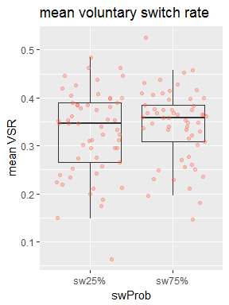
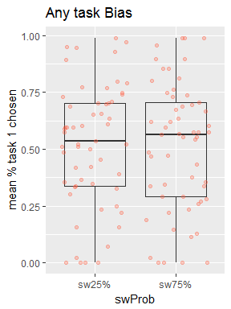

ISSPxVTS\_v5 analysis
================
Yu-Chin Chiu
July 11, 2018

``` r
knitr::opts_chunk$set(fig.width=6, fig.height=4, fig.path='figure/', echo = FALSE, warning = FALSE, message = FALSE)
options(width = 9999)
```

#### First, Set up the environment and load the data: gpData.csv

This file came from python scripts - cleaning and preprocessing

#### Set up some formating for the plots

Set up some good format, here I am using apatheme with white background, with black axis lines, no grids.

    ## [1] 70

    ## [1] 57

RESULTS:
--------

### 1. Cued trials

#### Analyze RT & ACC with 2 phase x 2 swProb x trialType\_sw

    ## 
    ## 
    ## ANOVA results
    ##  
    ## 
    ##                      Predictor df_num df_den       SS_num     SS_den       F    p ges
    ##                    (Intercept)      1     56 312267582.97 4966692.42 3520.85 .000 .98
    ##                          phase      1     56     43324.67  216358.01   11.21 .001 .01
    ##                         swProb      1     56       186.20   58398.82    0.18 .674 .00
    ##                   trialType_sw      1     56    559802.51  239491.23  130.90 .000 .09
    ##                 phase x swProb      1     56       499.52   39204.96    0.71 .402 .00
    ##           phase x trialType_sw      1     56      7162.64   72249.01    5.55 .022 .00
    ##          swProb x trialType_sw      1     56     11401.61   32178.00   19.84 .000 .00
    ##  phase x swProb x trialType_sw      1     56       203.53   33833.81    0.34 .564 .00
    ## 
    ## Note. df_num indicates degrees of freedom numerator. df_den indicates degrees of freedom denominator. 
    ## SS_num indicates sum of squares numerator. SS_den indicates sum of squares denominator. 
    ## ges indicates generalized eta-squared.
    ## 

    ## 
    ## 
    ## ANOVA results
    ##  
    ## 
    ##                      Predictor df_num df_den SS_num SS_den       F    p ges
    ##                    (Intercept)      1     56 357.23   3.32 6022.09 .000 .99
    ##                          phase      1     56   0.07   0.79    4.77 .033 .01
    ##                         swProb      1     56   0.00   0.13    1.96 .167 .00
    ##                   trialType_sw      1     56   0.15   0.19   44.51 .000 .03
    ##                 phase x swProb      1     56   0.01   0.14    2.37 .129 .00
    ##           phase x trialType_sw      1     56   0.00   0.09    0.06 .803 .00
    ##          swProb x trialType_sw      1     56   0.00   0.05    5.04 .029 .00
    ##  phase x swProb x trialType_sw      1     56   0.00   0.07    0.11 .746 .00
    ## 
    ## Note. df_num indicates degrees of freedom numerator. df_den indicates degrees of freedom denominator. 
    ## SS_num indicates sum of squares numerator. SS_den indicates sum of squares denominator. 
    ## ges indicates generalized eta-squared.
    ## 

    ## # A tibble: 8 x 7
    ## # Groups:   phase, swProb [?]
    ##      phase swProb trialType_sw gpmeanRT    SE_rt gpmeanACC   SE_acc
    ##      <ord>  <ord>        <ord>    <dbl>    <dbl>     <dbl>    <dbl>
    ## 1 training  sw25%       repeat 794.2884 5.498436  91.08084 0.785299
    ## 2 training  sw25%       switch 883.6271 5.498436  87.03252 0.785299
    ## 3 training  sw75%       repeat 802.2540 5.498436  91.87889 0.785299
    ## 4 training  sw75%       switch 868.9190 5.498436  88.91546 0.785299
    ## 5   hybrid  sw25%       repeat 781.9632 5.498436  89.56093 0.785299
    ## 6   hybrid  sw25%       switch 852.7765 5.498436  85.10720 0.785299
    ## 7   hybrid  sw75%       repeat 791.4430 5.498436  88.72326 0.785299
    ## 8   hybrid  sw75%       switch 844.9272 5.498436  85.78130 0.785299

#### Figure 1a: Cued - RT


#### Figure 1b: Cued - ACC


### 2. Choice trials

#### Analyze RT & ACC with 2 swProb x 2 trialType\_sw

    ## 
    ## 
    ## ANOVA results
    ##  
    ## 
    ##              Predictor df_num df_den       SS_num     SS_den       F    p ges
    ##            (Intercept)      1     56 133557099.13 1944484.25 3846.37 .000 .98
    ##                 swProb      1     56       194.63   89662.58    0.12 .729 .00
    ##           trialType_sw      1     56    111872.28  111050.81   56.41 .000 .05
    ##  swProb x trialType_sw      1     56      2701.20   45358.85    3.33 .073 .00
    ## 
    ## Note. df_num indicates degrees of freedom numerator. df_den indicates degrees of freedom denominator. 
    ## SS_num indicates sum of squares numerator. SS_den indicates sum of squares denominator. 
    ## ges indicates generalized eta-squared.
    ## 

    ## 
    ## 
    ## ANOVA results
    ##  
    ## 
    ##              Predictor df_num df_den SS_num SS_den        F    p  ges
    ##            (Intercept)      1     56 206.12   0.64 17975.37 .000 1.00
    ##                 swProb      1     56   0.00   0.05     0.03 .870  .00
    ##           trialType_sw      1     56   0.00   0.09     0.42 .519  .00
    ##  swProb x trialType_sw      1     56   0.00   0.05     0.03 .859  .00
    ## 
    ## Note. df_num indicates degrees of freedom numerator. df_den indicates degrees of freedom denominator. 
    ## SS_num indicates sum of squares numerator. SS_den indicates sum of squares denominator. 
    ## ges indicates generalized eta-squared.
    ## 

    ## # A tibble: 4 x 6
    ## # Groups:   swProb [?]
    ##   swProb trialType_sw gpmeanRT    SE_rt gpmeanACC    SE_acc
    ##    <ord>        <ord>    <dbl>    <dbl>     <dbl>     <dbl>
    ## 1  sw25%       repeat 740.6914 4.997713  95.32307 0.4513392
    ## 2  sw25%       switch 791.8775 4.997713  94.90805 0.4513392
    ## 3  sw75%       repeat 745.7276 4.997713  95.18544 0.4513392
    ## 4  sw75%       switch 783.1456 4.997713  94.91049 0.4513392

#### Figure 2a: Choice - RT


#### Figure 2b: Choice - ACC


### 3. Choice trials

#### Analyze VSR and tskRatio with 2 swProb

    ## 
    ## 
    ## ANOVA results
    ##  
    ## 
    ##    Predictor df_num df_den SS_num SS_den       F    p ges
    ##  (Intercept)      1     56  12.77   0.66 1077.00 .000 .94
    ##       swProb      1     56   0.01   0.09    4.85 .032 .01
    ## 
    ## Note. df_num indicates degrees of freedom numerator. df_den indicates degrees of freedom denominator. 
    ## SS_num indicates sum of squares numerator. SS_den indicates sum of squares denominator. 
    ## ges indicates generalized eta-squared.
    ## 

    ## 
    ## 
    ## ANOVA results
    ##  
    ## 
    ##    Predictor df_num df_den SS_num SS_den      F    p ges
    ##  (Intercept)      1     56  29.93   8.08 207.42 .000 .78
    ##       swProb      1     56   0.00   0.43   0.09 .760 .00
    ## 
    ## Note. df_num indicates degrees of freedom numerator. df_den indicates degrees of freedom denominator. 
    ## SS_num indicates sum of squares numerator. SS_den indicates sum of squares denominator. 
    ## ges indicates generalized eta-squared.
    ## 

    ## # A tibble: 2 x 6
    ##   swProb gpmeanVSR SE_vsr gpmeanTskRatio SE_tskR trialCNT
    ##    <ord>     <dbl>  <dbl>          <dbl>   <dbl>    <dbl>
    ## 1  sw25%  32.64858     NA       51.49491      NA 93.66667
    ## 2  sw75%  34.29089     NA       50.99056      NA 93.57895

#### Figure 3a: VSR ~ swProb



#### Figure 3b: taskBias ~swProb



Exploratory analysis
====================

### 4. Choice trials

#### Analyze VSR with 3 blocks ("run\_3bk") x 2 swProb

    ## $ANOVA
    ##           Effect DFn DFd         SSn       SSd            F            p p<.05         ges
    ## 1    (Intercept)   1  56 38.30734823 1.9909687 1077.4712249 2.899294e-38     * 0.907762946
    ## 2        run_3bk   2 112  0.03651604 0.7951455    2.5717286 8.090944e-02       0.009294228
    ## 3         swProb   1  56  0.02419046 0.2734591    4.9538138 3.007617e-02     * 0.006176441
    ## 4 run_3bk:swProb   2 112  0.01367043 0.8328052    0.9192357 4.018113e-01       0.003499811
    ## 
    ## $`Mauchly's Test for Sphericity`
    ##           Effect         W         p p<.05
    ## 2        run_3bk 0.9698339 0.4307031      
    ## 4 run_3bk:swProb 0.9733342 0.4755595      
    ## 
    ## $`Sphericity Corrections`
    ##           Effect       GGe      p[GG] p[GG]<.05      HFe      p[HF] p[HF]<.05
    ## 2        run_3bk 0.9707173 0.08266852           1.005038 0.08090944          
    ## 4 run_3bk:swProb 0.9740268 0.39969623           1.008651 0.40181132

    ## # A tibble: 6 x 4
    ## # Groups:   run_3bk [?]
    ##   run_3bk swProb gpmeanVSR   SE_vsr
    ##     <ord>  <ord>     <dbl>    <dbl>
    ## 1      B1  sw25%  33.46824 1.099431
    ## 2      B1  sw75%  33.41193 1.099431
    ## 3      B2  sw25%  31.12242 1.099431
    ## 4      B2  sw75%  33.31047 1.099431
    ## 5      B3  sw25%  33.28985 1.099431
    ## 6      B3  sw75%  36.20427 1.099431

#### Figure 4: VSR: 3 blocks x 2 swProb


### 5. Choice trials

#### Analyze VSR with 2 blocks ("run\_2bk") x 2 swProb

    ## $ANOVA
    ##           Effect DFn DFd          SSn       SSd            F            p p<.05          ges
    ## 1    (Intercept)   1  56 2.561572e+01 1.3377939 1.072273e+03 3.297917e-38     * 0.9195630790
    ## 2        run_2bk   1  56 5.775048e-04 0.4150005 7.792826e-02 7.811532e-01       0.0002576696
    ## 3         swProb   1  56 1.619042e-02 0.1728938 5.244050e+00 2.581125e-02     * 0.0071738289
    ## 4 run_2bk:swProb   1  56 6.551166e-03 0.3149949 1.164671e+00 2.851254e-01       0.0029152127

    ## # A tibble: 4 x 4
    ## # Groups:   run_2bk [?]
    ##   run_2bk swProb gpmeanVSR    SE_vsr
    ##     <ord>  <ord>     <dbl>     <dbl>
    ## 1  first3  sw25%  33.05280 0.9749929
    ## 2  first3  sw75%  33.66609 0.9749929
    ## 3   last3  sw25%  32.29904 0.9749929
    ## 4   last3  sw75%  35.05646 0.9749929

#### Figure 5: VSR: 2 blocks x 2 swProb


### 6. Choice trials

#### Analyze VSR with 2 blocks ("runId2" - first 2 & last 4) x 2 swProb

    ## $ANOVA
    ##          Effect DFn DFd          SSn       SSd            F            p p<.05          ges
    ## 1   (Intercept)   1  56 2.552286e+01 1.4209355 1.005872e+03 1.805073e-37     * 9.183716e-01
    ## 2        runId2   1  56 7.146858e-06 0.2727200 1.467527e-03 9.695781e-01       3.150370e-06
    ## 3        swProb   1  56 8.668168e-03 0.2151129 2.256570e+00 1.386668e-01       3.806439e-03
    ## 4 runId2:swProb   1  56 9.477841e-03 0.3598016 1.475144e+00 2.296326e-01       4.160510e-03

    ## # A tibble: 4 x 4
    ## # Groups:   runId2 [?]
    ##   runId2 swProb gpmeanVSR    SE_vsr
    ##    <ord>  <ord>     <dbl>     <dbl>
    ## 1 first2  sw25%  33.46824 0.9406437
    ## 2 first2  sw75%  33.41193 0.9406437
    ## 3  last4  sw25%  32.21416 0.9406437
    ## 4  last4  sw75%  34.73683 0.9406437

#### Figure 6: VSR: 2 blocks ("runId2" - first 2 & last 4) x 2 swProb


### 7. Choice trials

#### Correlation between ISSP\_train and overall VSR

#### Figure 7: correlation between ISSP\_train & mean VSR


    ## 
    ##  Pearson's product-moment correlation
    ## 
    ## data:  summary$ISSP_train and summary$meanVSR
    ## t = 2.2298, df = 55, p-value = 0.02986
    ## alternative hypothesis: true correlation is not equal to 0
    ## 95 percent confidence interval:
    ##  0.0295838 0.5102199
    ## sample estimates:
    ##       cor 
    ## 0.2879319

### 8. Choice trials

#### Correlation between ISSP\_choice and VSReffect

#### Figure 8: correlation between ISSP\_hybrid\_choice & VSR effect


    ## 
    ##  Pearson's product-moment correlation
    ## 
    ## data:  summary$ISSP_choice and summary$VSReffect
    ## t = 2.7903, df = 55, p-value = 0.007224
    ## alternative hypothesis: true correlation is not equal to 0
    ## 95 percent confidence interval:
    ##  0.1008262 0.5612147
    ## sample estimates:
    ##       cor 
    ## 0.3521424
