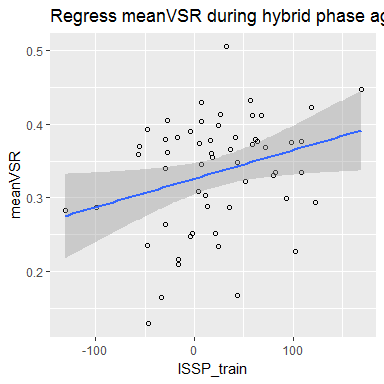

ISSPxVTS\_v5 analysis
================
Yu-Chin Chiu
July 10, 2018

``` r
knitr::opts_chunk$set(fig.width=6, fig.height=4, fig.path='figure/', echo = FALSE, warning = FALSE, message = FALSE)
options(width = 9999)
```

#### First, Set up the environment and load the data: gpData.csv

This file came from python scripts - cleaning and preprocessing

#### Set up some formating for the plots

Set up some good format, here I am using apatheme with white background, with black axis lines, no grids.

    ## [1] 70

    ## [1] 57

RESULTS:
--------

### 1. Cued trials

#### Analyze with 2 phase x 2 swProb x trialType\_sw

    ## # A tibble: 8 x 7
    ## # Groups:   phase, swProb [?]
    ##      phase swProb trialType_sw gpmeanRT    SE_rt gpmeanACC   SE_acc
    ##      <ord>  <ord>        <ord>    <dbl>    <dbl>     <dbl>    <dbl>
    ## 1 training  sw25%       repeat 794.2884 5.502988  91.08084 0.785299
    ## 2 training  sw25%       switch 883.6271 5.502988  87.03252 0.785299
    ## 3 training  sw75%       repeat 801.9320 5.502988  91.87889 0.785299
    ## 4 training  sw75%       switch 868.9190 5.502988  88.91546 0.785299
    ## 5   hybrid  sw25%       repeat 781.7211 5.502988  89.56093 0.785299
    ## 6   hybrid  sw25%       switch 852.6542 5.502988  85.10720 0.785299
    ## 7   hybrid  sw75%       repeat 791.4430 5.502988  88.72326 0.785299
    ## 8   hybrid  sw75%       switch 844.8044 5.502988  85.78130 0.785299

#### Figure 1: RT


    ## 
    ## 
    ## ANOVA results
    ##  
    ## 
    ##                      Predictor df_num df_den       SS_num     SS_den       F    p ges
    ##                    (Intercept)      1     56 312191238.66 4953907.76 3529.07 .000 .98
    ##                          phase      1     56     43508.53  216665.67   11.25 .001 .01
    ##                         swProb      1     56       192.09   58690.78    0.18 .670 .00
    ##                   trialType_sw      1     56    561077.42  239183.73  131.36 .000 .09
    ##                 phase x swProb      1     56       569.04   39700.61    0.80 .374 .00
    ##           phase x trialType_sw      1     56      7310.24   72918.58    5.61 .021 .00
    ##          swProb x trialType_sw      1     56     11356.37   31543.90   20.16 .000 .00
    ##  phase x swProb x trialType_sw      1     56       162.80   34147.09    0.27 .607 .00
    ## 
    ## Note. df_num indicates degrees of freedom numerator. df_den indicates degrees of freedom denominator. 
    ## SS_num indicates sum of squares numerator. SS_den indicates sum of squares denominator. 
    ## ges indicates generalized eta-squared.
    ## 

#### Figure 2: Acc


    ## 
    ## 
    ## ANOVA results
    ##  
    ## 
    ##                      Predictor df_num df_den SS_num SS_den       F    p ges
    ##                    (Intercept)      1     56 357.23   3.32 6022.09 .000 .99
    ##                          phase      1     56   0.07   0.79    4.77 .033 .01
    ##                         swProb      1     56   0.00   0.13    1.96 .167 .00
    ##                   trialType_sw      1     56   0.15   0.19   44.51 .000 .03
    ##                 phase x swProb      1     56   0.01   0.14    2.37 .129 .00
    ##           phase x trialType_sw      1     56   0.00   0.09    0.06 .803 .00
    ##          swProb x trialType_sw      1     56   0.00   0.05    5.04 .029 .00
    ##  phase x swProb x trialType_sw      1     56   0.00   0.07    0.11 .746 .00
    ## 
    ## Note. df_num indicates degrees of freedom numerator. df_den indicates degrees of freedom denominator. 
    ## SS_num indicates sum of squares numerator. SS_den indicates sum of squares denominator. 
    ## ges indicates generalized eta-squared.
    ## 

### 2. Choice trials

#### Analyze with RT/ACC with 2 swProb x 2 trialType\_sw

#### Figure 3: RT


    ## 
    ## 
    ## ANOVA results
    ##  
    ## 
    ##              Predictor df_num df_den       SS_num     SS_den       F    p ges
    ##            (Intercept)      1     56 133557099.13 1944484.25 3846.37 .000 .98
    ##                 swProb      1     56       194.63   89662.58    0.12 .729 .00
    ##           trialType_sw      1     56    111872.28  111050.81   56.41 .000 .05
    ##  swProb x trialType_sw      1     56      2701.20   45358.85    3.33 .073 .00
    ## 
    ## Note. df_num indicates degrees of freedom numerator. df_den indicates degrees of freedom denominator. 
    ## SS_num indicates sum of squares numerator. SS_den indicates sum of squares denominator. 
    ## ges indicates generalized eta-squared.
    ## 

#### Figure 4: ACC


    ## 
    ## 
    ## ANOVA results
    ##  
    ## 
    ##              Predictor df_num df_den SS_num SS_den        F    p  ges
    ##            (Intercept)      1     56 206.12   0.64 17975.37 .000 1.00
    ##                 swProb      1     56   0.00   0.05     0.03 .870  .00
    ##           trialType_sw      1     56   0.00   0.09     0.42 .519  .00
    ##  swProb x trialType_sw      1     56   0.00   0.05     0.03 .859  .00
    ## 
    ## Note. df_num indicates degrees of freedom numerator. df_den indicates degrees of freedom denominator. 
    ## SS_num indicates sum of squares numerator. SS_den indicates sum of squares denominator. 
    ## ges indicates generalized eta-squared.
    ## 

### 3. Choice trials

#### Analyze VSR and tskRatio with 2 swProb

    ## # A tibble: 2 x 5
    ##   swProb gpmeanVSR   SE_vsr gpmeanTskRatio  SE_tskR
    ##    <ord>     <dbl>    <dbl>          <dbl>    <dbl>
    ## 1  sw25%  32.64858 0.532147       51.49491 1.172383
    ## 2  sw75%  34.29089 0.532147       50.99056 1.172383

#### Figure 5: VSR


    ## 
    ## 
    ## ANOVA results
    ##  
    ## 
    ##    Predictor df_num df_den SS_num SS_den       F    p ges
    ##  (Intercept)      1     56  12.77   0.66 1077.00 .000 .94
    ##       swProb      1     56   0.01   0.09    4.85 .032 .01
    ## 
    ## Note. df_num indicates degrees of freedom numerator. df_den indicates degrees of freedom denominator. 
    ## SS_num indicates sum of squares numerator. SS_den indicates sum of squares denominator. 
    ## ges indicates generalized eta-squared.
    ## 

#### Figure 6: taskBias


    ## 
    ## 
    ## ANOVA results
    ##  
    ## 
    ##    Predictor df_num df_den SS_num SS_den      F    p ges
    ##  (Intercept)      1     56  29.93   8.08 207.42 .000 .78
    ##       swProb      1     56   0.00   0.43   0.09 .760 .00
    ## 
    ## Note. df_num indicates degrees of freedom numerator. df_den indicates degrees of freedom denominator. 
    ## SS_num indicates sum of squares numerator. SS_den indicates sum of squares denominator. 
    ## ges indicates generalized eta-squared.
    ## 

### 4. Choice trials

#### Analyze VSR with 3 runId\_half x 2 swProb

#### Figure 7: VSR: 3 runHalf x 2 swProb



    ## $ANOVA
    ##              Effect DFn DFd         SSn       SSd            F            p p<.05         ges
    ## 1       (Intercept)   1  56 38.30734823 1.9909687 1077.4712249 2.899294e-38     * 0.907762946
    ## 2        runId_half   2 112  0.03651604 0.7951455    2.5717286 8.090944e-02       0.009294228
    ## 3            swProb   1  56  0.02419046 0.2734591    4.9538138 3.007617e-02     * 0.006176441
    ## 4 runId_half:swProb   2 112  0.01367043 0.8328052    0.9192357 4.018113e-01       0.003499811
    ## 
    ## $`Mauchly's Test for Sphericity`
    ##              Effect         W         p p<.05
    ## 2        runId_half 0.9698339 0.4307031      
    ## 4 runId_half:swProb 0.9733342 0.4755595      
    ## 
    ## $`Sphericity Corrections`
    ##              Effect       GGe      p[GG] p[GG]<.05      HFe      p[HF] p[HF]<.05
    ## 2        runId_half 0.9707173 0.08266852           1.005038 0.08090944          
    ## 4 runId_half:swProb 0.9740268 0.39969623           1.008651 0.40181132

### 5. Choice trials

#### Analyze VSR with \[2bk,4bk\] 2 halfs(uneven) x 2 swProb

#### Figure 8: VSR: 2 unevenHalfs x 2 swProb


    ## $ANOVA
    ##          Effect DFn DFd          SSn       SSd            F            p p<.05          ges
    ## 1   (Intercept)   1  56 2.552286e+01 1.4209355 1.005872e+03 1.805073e-37     * 9.183716e-01
    ## 2        runId2   1  56 7.146858e-06 0.2727200 1.467527e-03 9.695781e-01       3.150370e-06
    ## 3        swProb   1  56 8.668168e-03 0.2151129 2.256570e+00 1.386668e-01       3.806439e-03
    ## 4 runId2:swProb   1  56 9.477841e-03 0.3598016 1.475144e+00 2.296326e-01       4.160510e-03

### 6. Choice trials

#### Correlation between ISSP\_train and overall VSR


    ## 
    ##  Pearson's product-moment correlation
    ## 
    ## data:  summary$ISSP_train and summary$meanVSR
    ## t = 2.188, df = 55, p-value = 0.03294
    ## alternative hypothesis: true correlation is not equal to 0
    ## 95 percent confidence interval:
    ##  0.02418296 0.50621115
    ## sample estimates:
    ##       cor 
    ## 0.2829675

### 7. Choice trials

#### Correlation between ISSP\_choice and VSReffect


    ## 
    ##  Pearson's product-moment correlation
    ## 
    ## data:  summary$ISSP_choice and summary$VSReffect
    ## t = 2.7903, df = 55, p-value = 0.007224
    ## alternative hypothesis: true correlation is not equal to 0
    ## 95 percent confidence interval:
    ##  0.1008262 0.5612147
    ## sample estimates:
    ##       cor 
    ## 0.3521424
