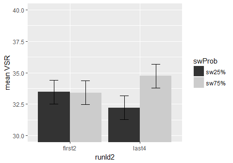

    knitr::opts_chunk$set(fig.width=6, fig.height=4, fig.path='figure/', echo = FALSE, warning = FALSE, message = FALSE)

#### First, Set up the environment and load the data: gpData.csv

This file came from python scripts - cleaning and preprocessing

#### Set up some formating for the plots

Set up some good format, here I am using apatheme with white background,
with black axis lines, no grids.

RESULTS:
--------

### 1. Cued trials

#### Analyze with 2 phase x 2 swProb x trialType\_sw

#### Figure 1: RT

    ## $ANOVA
    ##                      Effect DFn DFd          SSn        SSd            F
    ## 1               (Intercept)   1  39 2.097253e+08 3330911.88 2455.5703984
    ## 2                     phase   1  39 3.629620e+04  195846.80    7.2278526
    ## 3                    swProb   1  39 2.764147e+02   41323.71    0.2608714
    ## 4              trialType_sw   1  39 3.404905e+05  178730.01   74.2971532
    ## 5              phase:swProb   1  39 1.051895e+02   30283.17    0.1354678
    ## 6        phase:trialType_sw   1  39 3.000149e+03   52269.81    2.2384965
    ## 7       swProb:trialType_sw   1  39 7.686732e+03   26375.68   11.3658688
    ## 8 phase:swProb:trialType_sw   1  39 1.892957e+03   25606.23    2.8830994
    ##              p p<.05          ges
    ## 1 7.784311e-37     * 9.818295e-01
    ## 2 1.050282e-02     * 9.264804e-03
    ## 3 6.124014e-01       7.121110e-05
    ## 4 1.439912e-10     * 8.064984e-02
    ## 5 7.148191e-01       2.710056e-05
    ## 6 1.426612e-01       7.723687e-04
    ## 7 1.698310e-03     * 1.976514e-03
    ## 8 9.748026e-02       4.874684e-04

#### Figure 2: Acc

    ## $ANOVA
    ##                      Effect DFn DFd          SSn        SSd            F
    ## 1               (Intercept)   1  39 2.530437e+02 2.57037816 3.839398e+03
    ## 2                     phase   1  39 1.067381e-01 0.69236680 6.012399e+00
    ## 3                    swProb   1  39 5.154705e-05 0.08240331 2.439629e-02
    ## 4              trialType_sw   1  39 6.206628e-02 0.10382073 2.331504e+01
    ## 5              phase:swProb   1  39 1.405381e-04 0.05086014 1.077659e-01
    ## 6        phase:trialType_sw   1  39 2.315099e-03 0.04607624 1.959553e+00
    ## 7       swProb:trialType_sw   1  39 4.824377e-04 0.03208948 5.863313e-01
    ## 8 phase:swProb:trialType_sw   1  39 9.399691e-04 0.04614250 7.944692e-01
    ##              p p<.05          ges
    ## 1 1.421511e-40     * 9.858800e-01
    ## 2 1.878618e-02     * 2.860940e-02
    ## 3 8.766865e-01       1.422306e-05
    ## 4 2.148023e-05     * 1.683745e-02
    ## 5 7.444582e-01       3.877686e-05
    ## 6 1.694659e-01       6.383921e-04
    ## 7 4.484509e-01       1.331002e-04
    ## 8 3.782184e-01       2.592963e-04

### 2. Choice trials

#### Analyze with 2 swProb x trialType\_sw

#### Figure 3: RT

    ## $ANOVA
    ##                Effect DFn DFd          SSn        SSd            F
    ## 1         (Intercept)   1  39 8.866590e+07 1322206.53 2615.3024124
    ## 2              swProb   1  39 2.200211e+03   40303.96    2.1290274
    ## 3        trialType_sw   1  39 4.691439e+04   77335.71   23.6586860
    ## 4 swProb:trialType_sw   1  39 5.076294e+02   26128.68    0.7576942
    ##              p p<.05          ges
    ## 1 2.319570e-37     * 0.9837352219
    ## 2 1.525404e-01       0.0014986026
    ## 3 1.921767e-05     * 0.0310098001
    ## 4 3.893775e-01       0.0003461544

#### Figure 4: ACC

    ## $ANOVA
    ##                Effect DFn DFd          SSn        SSd            F
    ## 1         (Intercept)   1  39 1.437530e+02 0.52168910 1.074656e+04
    ## 2              swProb   1  39 5.774797e-04 0.03160517 7.125959e-01
    ## 3        trialType_sw   1  39 2.645872e-03 0.07236377 1.425976e+00
    ## 4 swProb:trialType_sw   1  39 1.114308e-04 0.03893647 1.116126e-01
    ##              p p<.05          ges
    ## 1 3.088136e-49     * 0.9953981043
    ## 2 4.037319e-01       0.0008681661
    ## 3 2.396350e-01       0.0039653953
    ## 4 7.401056e-01       0.0001676392

### 3. Choice trials

#### Analyze VSR and tskRatio with 2 swProb

#### Figure 5: VSR

    ## $ANOVA
    ##        Effect DFn DFd         SSn        SSd           F            p
    ## 1 (Intercept)   1  39 9.713590675 0.32058598 1181.679975 8.858303e-31
    ## 2      swProb   1  39 0.002315078 0.06000167    1.504759 2.272950e-01
    ##   p<.05         ges
    ## 1     * 0.962296322
    ## 2       0.006046126

#### Figure 6: taskBias

    ## $ANOVA
    ##        Effect DFn DFd         SSn       SSd          F            p p<.05
    ## 1 (Intercept)   1  39 20.93208053 7.0846399 115.228318 3.311069e-13     *
    ## 2      swProb   1  39  0.01167387 0.3204887   1.420583 2.405099e-01      
    ##           ges
    ## 1 0.738678268
    ## 2 0.001573976

### 4. Choice trials

#### Analyze VSR with 2 runId\_half x 2 swProb

#### Figure 7: VSR: 2 runHalf

    ## $ANOVA
    ##              Effect DFn DFd          SSn       SSd            F
    ## 1       (Intercept)   1  39 19.489664685 0.6408901 1186.0019350
    ## 2        runId_half   1  39  0.006884349 0.2243151    1.1969307
    ## 3            swProb   1  39  0.004616441 0.1164709    1.5458045
    ## 4 runId_half:swProb   1  39  0.003637526 0.2801326    0.5064157
    ##              p p<.05         ges
    ## 1 8.267894e-31     * 0.939194263
    ## 2 2.806473e-01       0.005426331
    ## 3 2.211783e-01       0.003645254
    ## 4 4.809299e-01       0.002874501

    ## $ANOVA
    ##        Effect DFn DFd        SSn        SSd           F            p p<.05
    ## 1 (Intercept)   1  39 9.81576444 0.34242185 1117.962582 2.521939e-30     *
    ## 2           p   1  39 0.01266919 0.09949547    4.966041 3.168538e-02     *
    ##          ges
    ## 1 0.95691840
    ## 2 0.02786971

