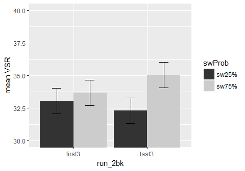

    knitr::opts_chunk$set(fig.width=6, fig.height=4, fig.path='figure/', echo = FALSE, warning = FALSE, message = FALSE)

#### First, Set up the environment and load the data: gpData.csv

This file came from python scripts - cleaning and preprocessing

#### Set up some formating for the plots

Set up some good format, here I am using apatheme with white background,
with black axis lines, no grids.

#### First summarize individual subject's data

#### Then, calculate the group mean and within-subject SEM using "getWSSE" (a function I wrote)

    ## [1] "Group means:"

    ## [1] "cued: swCost:75% = 56.70 ms"

    ## [1] "cued: swCost:25% = 86.03 ms"

### RESULTS:

#### Figure 1: cued trials: ISSP(phase x swProb x trialtype\_sw) effect in **RT** (correct trials)

#### 3-way ANOVA: cued trials: RT ~ 2 phase x 2 swProb x 2 trialType\_sw

    ## $ANOVA
    ##                      Effect DFn DFd          SSn        SSd            F
    ## 1               (Intercept)   1  39 2.097253e+08 3330911.88 2455.5703984
    ## 2                     phase   1  39 3.629620e+04  195846.80    7.2278526
    ## 3                    swProb   1  39 2.764147e+02   41323.71    0.2608714
    ## 4              trialType_sw   1  39 3.404905e+05  178730.01   74.2971532
    ## 5              phase:swProb   1  39 1.051895e+02   30283.17    0.1354678
    ## 6        phase:trialType_sw   1  39 3.000149e+03   52269.81    2.2384965
    ## 7       swProb:trialType_sw   1  39 7.686732e+03   26375.68   11.3658688
    ## 8 phase:swProb:trialType_sw   1  39 1.892957e+03   25606.23    2.8830994
    ##              p p<.05          ges
    ## 1 7.784311e-37     * 9.818295e-01
    ## 2 1.050282e-02     * 9.264804e-03
    ## 3 6.124014e-01       7.121110e-05
    ## 4 1.439912e-10     * 8.064984e-02
    ## 5 7.148191e-01       2.710056e-05
    ## 6 1.426612e-01       7.723687e-04
    ## 7 1.698310e-03     * 1.976514e-03
    ## 8 9.748026e-02       4.874684e-04

#### 2-way ANOVA: cued trials only across both phases: RT ~ 2 swProb x 2 trialType

    ## $ANOVA
    ##                Effect DFn DFd          SSn        SSd            F
    ## 1         (Intercept)   1  39 1.039515e+08 1617007.82 2507.1665511
    ## 2              swProb   1  39 2.546949e+02   19124.12    0.5194019
    ## 3        trialType_sw   1  39 1.574160e+05   86183.66   71.2342167
    ## 4 swProb:trialType_sw   1  39 1.686519e+03   10863.59    6.0545593
    ##              p p<.05          ges
    ## 1 5.221297e-37     * 0.9836004666
    ## 2 4.753949e-01       0.0001469308
    ## 3 2.474008e-10     * 0.0832626864
    ## 4 1.840306e-02     * 0.0009721324

#### Figure 2: ISSP(swProb x trialtype\_sw) effect in **accuracy** by phase

#### 3-way ANOVA: cued trials: ACCURACY ~ 2 phase x 2 swProb x 2 trialType\_sw

    ## $ANOVA
    ##                      Effect DFn DFd          SSn        SSd            F
    ## 1               (Intercept)   1  39 2.530437e+02 2.57037816 3.839398e+03
    ## 2                     phase   1  39 1.067381e-01 0.69236680 6.012399e+00
    ## 3                    swProb   1  39 5.154705e-05 0.08240331 2.439629e-02
    ## 4              trialType_sw   1  39 6.206628e-02 0.10382073 2.331504e+01
    ## 5              phase:swProb   1  39 1.405381e-04 0.05086014 1.077659e-01
    ## 6        phase:trialType_sw   1  39 2.315099e-03 0.04607624 1.959553e+00
    ## 7       swProb:trialType_sw   1  39 4.824377e-04 0.03208948 5.863313e-01
    ## 8 phase:swProb:trialType_sw   1  39 9.399691e-04 0.04614250 7.944692e-01
    ##              p p<.05          ges
    ## 1 1.421511e-40     * 9.858800e-01
    ## 2 1.878618e-02     * 2.860940e-02
    ## 3 8.766865e-01       1.422306e-05
    ## 4 2.148023e-05     * 1.683745e-02
    ## 5 7.444582e-01       3.877686e-05
    ## 6 1.694659e-01       6.383921e-04
    ## 7 4.484509e-01       1.331002e-04
    ## 8 3.782184e-01       2.592963e-04

#### Figure 3: Voluntary task-switching rate (VSR) ~ 2 swProb (25%, 75%)

    ## [1] "VSR_25% swProb = 34.31 %"

    ## [1] "VSR_75% swProb = 35.38 %"

    ## 
    ##  Welch Two Sample t-test
    ## 
    ## data:  meanVSR by swProb
    ## t = -0.68882, df = 76.935, p-value = 0.493
    ## alternative hypothesis: true difference in means is not equal to 0
    ## 95 percent confidence interval:
    ##  -0.04186157  0.02034377
    ## sample estimates:
    ## mean in group sw25% mean in group sw75% 
    ##           0.3430741           0.3538330

#### Figure 4: Voluntary task-switching rate (VSR) ~ 2 runHalf x 2 swProb (25%, 75%)

#### ANOVA: switch rate ~ 2 run x 2 swProb

    ## $ANOVA
    ##              Effect DFn DFd          SSn       SSd            F
    ## 1       (Intercept)   1  39 19.489664685 0.6408901 1186.0019350
    ## 2        runId_half   1  39  0.006884349 0.2243151    1.1969307
    ## 3            swProb   1  39  0.004616441 0.1164709    1.5458045
    ## 4 runId_half:swProb   1  39  0.003637526 0.2801326    0.5064157
    ##              p p<.05         ges
    ## 1 8.267894e-31     * 0.939194263
    ## 2 2.806473e-01       0.005426331
    ## 3 2.211783e-01       0.003645254
    ## 4 4.809299e-01       0.002874501

    ## # A tibble: 1 x 1
    ##   pval_ttest
    ##        <dbl>
    ## 1     0.1711

#### Figure 5: Task Bias ~ 2 swProb (25%, 75%)

    ## [1] "tskRatio_25% swProb = 52.36 % of task 1"

    ## [1] "tskRatio_75% swProb = 49.94 % of task 1"

    ## 
    ##  Welch Two Sample t-test
    ## 
    ## data:  tskRatio by swProb
    ## t = 0.35066, df = 77.91, p-value = 0.7268
    ## alternative hypothesis: true difference in means is not equal to 0
    ## 95 percent confidence interval:
    ##  -0.1130073  0.1613268
    ## sample estimates:
    ## mean in group sw25% mean in group sw75% 
    ##           0.5235982           0.4994385

    ## $ANOVA
    ##        Effect DFn DFd          SSn        SSd           F            p
    ## 1 (Intercept)   1  39 3.461793e+01 0.04600918 29344.12273 1.004034e-57
    ## 2         run   1  39 9.402544e-04 0.03355900     1.09270 3.023097e-01
    ## 3      swProb   1  39 3.748825e+00 0.04762653  3069.80492 1.062718e-38
    ## 4  run:swProb   1  39 1.576645e-03 0.04449157     1.38204 2.468810e-01
    ##   p<.05         ges
    ## 1     * 0.995065013
    ## 2       0.005446755
    ## 3     * 0.956208186
    ## 4       0.009099722

#### results of the bayesian ANOVA

